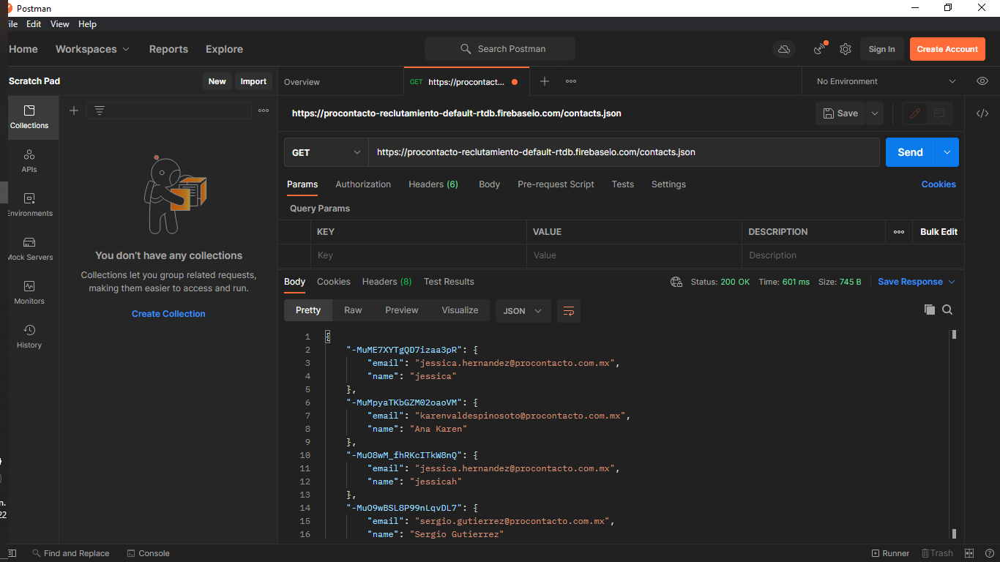
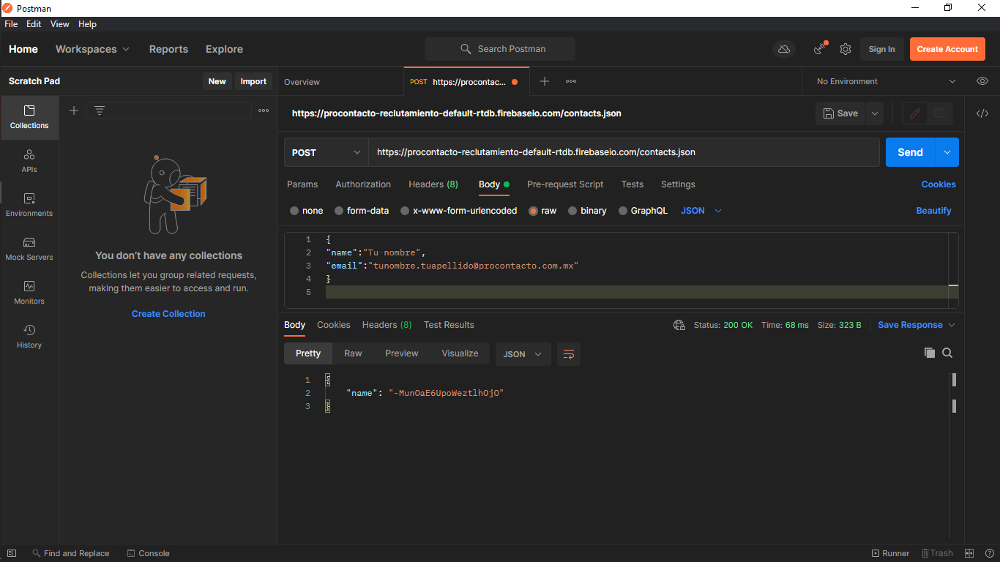
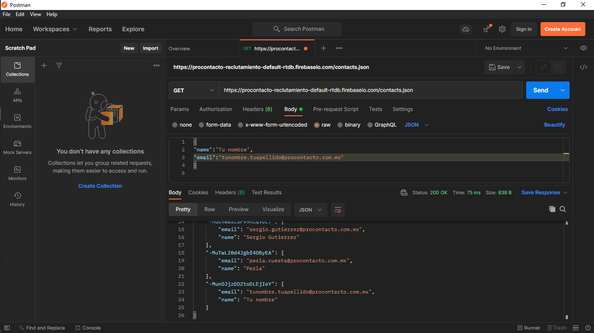

# EvaluaciónPráctica

## Ejercicio 1

Programas utilizados en la realización de esta práctica.
|[Visual Estudio Code](https://code.visualstudio.com)|[Git](https://git-scm.com)|[GitBash](https://gitforwindows.org)|[Postman](https://www.postman.com)|
|---------|-------------|-------|-------|
|||||

---

## Ejercicio 2

1. **¿Qué es un servidor HTTP?**
    Un servidor HTTP es un software el cual tiene como misión principal el devolver información cuando se reciben peticiones por parte de los usuarios.

2. **¿Qué son los verbos HTTP? Mencionar los más conocidos**
   Los verbos HTTP son una parte de la petición que se envía al servidor y son las acciones a las que el servidor debe de responder. Los más importantes son: GET, POST, PUT, PATCH, DELETE, HEAD, CONNECT, OPTIONS y TRACE.

3. **¿Qué es un request y un response en una comunicación HTTP? ¿Qué son los headers?**
   HTTP se basa en un modelo solicitud / respuesta, de modo que hay dos tipos de mensajes HTTP: *reponse y request.* El Request es cuando el cliente realiza una solicitud al servidor y el reponse es cuando el servidor procesa la solicitud y devuelve una respuesta. Los *Headers* son la parte central de los reponse y request ya que en ellos se encuentran datos como el navegador del cliente, la información solicitada, etc...

4. **¿Qué es un queryString? (En el contexto de una url)**
   Las *Query String* permiten acceder a páginas web dinámicas con distintas variables consiguiendo así que las páginas web no estén compuestas de decenas de directorios y permitiendo que su estructura esté basada en URL’s amigables. Además, es la parte de una URL que contiene los datos que deben pasar a las aplicaciones web.

5. **¿Qué es el responseCode? ¿Qué significado tiene los posibles valores devueltos?**
   El *responseCode* o el código de estado de respuesta indica si se ha completado satisfactoriamente una solicitud HTTP específica. Sus respuestas las podemos agrupar en:
   1. Respuestas informativas
   2. Respuestas satisfactorias
   3. Redirecciones
   4. Errores de los clientes
   5. Errores de los servidores

6. **¿Cómo se envía la data en un Get y cómo en un POST?**
   *GET* lleva los datos de forma "visible" al cliente (navegador web) y el medio de envío es la URL, en este verbo los datos los puede ver cualquiera. *POST* consiste en datos "ocultos" (porque el cliente no los ve) enviados por un formulario cuyo método de envío es post. En este verbo los datos no son visibles.

7. **¿Qué verbo http utiliza el navegador cuando accedemos a una página?**
   Depende, si al acceder a esa página web se van a enviar datos o archivos al servidor, como formularios o subida de imágenes, es aconsejable ocupar *POST* en cambio *GET* es más aconsejable ocuparlo si estamos realizando búsquedas, queremos guardar marcadores, etc.

8. **Explicar brevemente qué son las estructuras de datos JSON y XML dando ejemplo de estructuras posibles.**
   *XML* es uno de los formatos más utilizados para el intercambio de información entre sistemas. El formato de este estándar está basado en texto para representar información estructurada: datos, documentos, configuración, etc. Una etiqueta siempre está entre los valores < y > y para cerrar esa etiqueta utilizamos </ >. También podemos encontrar atributos, como es el caso de nuestra etiqueta raíz pieza que tiene el atributo tipo. Los atributos son una manera de añadir propiedades a los elementos y el contenido debe ir entrecomillado. Todas las etiquetas pueden tener uno, ninguno o varios atributos.
   Un ejemplo de su estructura de datos seria:

   ```
    <pieza tipo="A">
        <nombre>Tornillo</nombre>
        <descripcion>Cilindro mecanico con una cabeza utilizado en la fijación temporal de unas piezas con otras 
        </descripcion>
        <caracateristica>
            <tipo>metal</tipo>
            <tamanyo>10</tamanyo>
        </caracateristica>
        <vacio></vacio>
    </pieza>
   ```

   *JSON* es más legible por el ser humano e igual de eficaz que XML para la comunicación entre maquinas, está basado en un subconjunto del lenguaje de programación JavaScript y está construido por una colección de pares de nombre y valor o por una lista ordenada de valores. Un ejemplo de su estructura de datos seria:

   ```
    {
        “pieza”: {
            “tipo”: “A”
            “nombre”: “Tornillo”,
            “descripcion”: “Cilindro mecánico con una cabeza utilizado en la fijación temporal de unas piezas con otras”,
            “caracteristica”: {
                “tipo”: “metal”
                “tamanyo”: 10
            },
            “vacio”: “”
        }
    }
   ```

9. **Explicar brevemente el estándar SOAP**
    *SOAP* *(Simple Object Access Protocol)* nos permite la comunicación entre un cliente y los servicios de un servidor. Cuando el cliente envía la solicitud SOAP determina la forma que debe de adoptar dicha solicitud. Dentro de esta definición de la solicitud también se pueden incluir datos específicos de la aplicación, con esto los servicios web pueden desplegar aplicaciones diferentes y para que puedan ocuparse como servicios web sin necesidad de tener la misma sintaxis, SOAP establece unas reglas básicas. SOAP se basa en el metalenguaje XML y en la mayoría de los casos, se integra también en HTTP. El transporte se realiza a través del protocolo y se integra en su estructura.

10. **Explicar brevemente el estándar REST Full**
    *REST* deriva de *“REpresentational State Transfer”*, que traducido significaría *“Transferencia de representación de estado”.* Un servicio REST no posee estado, he de aquí la radicación de su nombre, lo que implica que entre dos llamadas cualesquiera, el servicio pierde todos sus datos. El estándar REST Full es un servicio que funciona como un estándar para compartir información, en un sistema de doble vía: Consulta y Respuesta (Request => Response). Al trabajar sobre el protocolo HTTP, los procedimientos o métodos de comunicación son los mismos que HTTP, siendo los principales: GET, POST, PUT, DELETE. Otros métodos que se utilizan en RESTfull son OPTIONS y HEAD. A pesar de la gran variedad de tipos de datos que podemos mandar con REST, la gran mayoría transmite en JSON por un motivo muy importante, JSON es interpretado de forma natural por JavaScript.

11. **¿Qué son los headers en un request? ¿Para qué se utiliza el key Content-type en un header?**
    Los *headers* en un request son pares como "Nombre:Valor" los cuales contienen información diversa sobre la solicitud HTTP y el navegador, como la versión del navegador y del sistema operativos, cookies, URL referidas, etc.. aunque la mayoría de los headers son opcionales.
    El *Content-Type* se utiliza para indicar el tipo de medio original del recurso, en las request el cliente dice le dice al servidor que tipos de datos se envía realmente.

---

## Ejercicio 3

1. **Realizar un request GET a la URL: <https://procontacto-reclutamiento-default-rtdb.firebaseio.com/contacts.json>**



2. **Realizar un request POST a la URL anterior, y con body:**

```
{
   "name":"Tu nombre",
   "email":tunombre.tuapellido@procontacto.com.mx
}
```

**Tip: (Marcar la opción “raw” como body)**



3. **Realizar nuevamente un request GET a la URL: <https://procontacto-reclutamiento-default-rtdb.firebaseio.com/contacts.json>**



**¿Qué diferencias se observan entre las llamadas el punto 1 y 3?**

En el punto 3 encontramos un nuevo bloque de datos, los cuales son los que agregamos cuando hicimos el *POST* en el ejercicio anterior.

---
