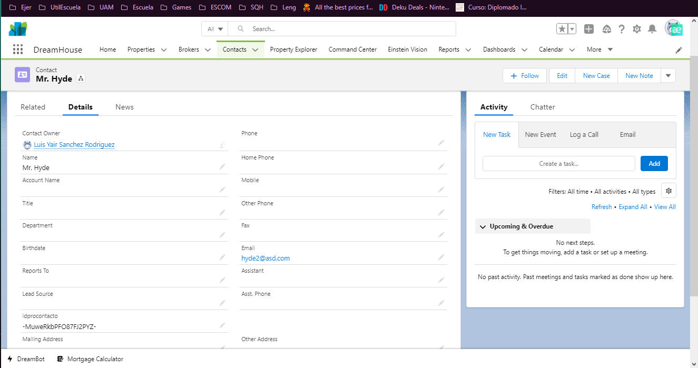

# EvaluaciónPráctica

## Ejercicio 1

Programas y plataformas utilizadas en la realización de esta práctica.
|[Visual Estudio Code](https://code.visualstudio.com)|[Git](https://git-scm.com)|[GitBash](https://gitforwindows.org)|[Postman](https://www.postman.com)|[Trailhead](https://trailhead.salesforce.com/today)|
|---------|-------------|-------|-------|------|
||||||

---

## Ejercicio 2

1. **¿Qué es un servidor HTTP?**
  
   > Un servidor HTTP es un software el cual tiene como misión principal el devolver información cuando se reciben peticiones por parte de los usuarios.

2. **¿Qué son los verbos HTTP? Mencionar los más conocidos**

   >Los verbos HTTP son una parte de la petición que se envía al servidor y son las acciones a las que el servidor debe de responder. Los más importantes son: GET, POST, PUT, PATCH, DELETE, HEAD, CONNECT, OPTIONS y TRACE.

3. **¿Qué es un request y un response en una comunicación HTTP? ¿Qué son los headers?**

   >HTTP se basa en un modelo solicitud / respuesta, de modo que hay dos tipos de mensajes HTTP: *reponse y request.* El Request es cuando el cliente realiza una solicitud al servidor y el reponse es cuando el servidor procesa la solicitud y devuelve una respuesta. Los *Headers* son la parte central de los reponse y request ya que en ellos se encuentran datos como el navegador del cliente, la información solicitada, etc...

4. **¿Qué es un queryString? (En el contexto de una url)**

   >Las *Query String* permiten acceder a páginas web dinámicas con distintas variables consiguiendo así que las páginas web no estén compuestas de decenas de directorios y permitiendo que su estructura esté basada en URL’s amigables. Además, es la parte de una URL que contiene los datos que deben pasar a las aplicaciones web.

5. **¿Qué es el responseCode? ¿Qué significado tiene los posibles valores devueltos?**

   >El *responseCode* o el código de estado de respuesta indica si se ha completado satisfactoriamente una solicitud HTTP específica. Sus respuestas las podemos agrupar en:
   1. Respuestas informativas
   2. Respuestas satisfactorias
   3. Redirecciones
   4. Errores de los clientes
   5. Errores de los servidores

6. **¿Cómo se envía la data en un Get y cómo en un POST?**

   >*GET* lleva los datos de forma "visible" al cliente (navegador web) y el medio de envío es la URL, en este verbo los datos los puede ver cualquiera. *POST* consiste en datos "ocultos" (porque el cliente no los ve) enviados por un formulario cuyo método de envío es post. En este verbo los datos no son visibles.

7. **¿Qué verbo http utiliza el navegador cuando accedemos a una página?**

   >Depende, si al acceder a esa página web se van a enviar datos o archivos al servidor, como formularios o subida de imágenes, es aconsejable ocupar *POST* en cambio *GET* es más aconsejable ocuparlo si estamos realizando búsquedas, queremos guardar marcadores, etc.

8. **Explicar brevemente qué son las estructuras de datos JSON y XML dando ejemplo de estructuras posibles.**

   >*XML* es uno de los formatos más utilizados para el intercambio de información entre sistemas. El formato de este estándar está basado en texto para representar información estructurada: datos, documentos, configuración, etc. Una etiqueta siempre está entre los valores < y > y para cerrar esa etiqueta utilizamos </ >. También podemos encontrar atributos, como es el caso de nuestra etiqueta raíz pieza que tiene el atributo tipo. Los atributos son una manera de añadir propiedades a los elementos y el contenido debe ir entrecomillado. Todas las etiquetas pueden tener uno, ninguno o varios atributos.
   Un ejemplo de su estructura de datos seria:

   ```HTML
    <pieza tipo="A">
        <nombre>Tornillo</nombre>
        <descripcion>Cilindro mecanico con una cabeza utilizado en la fijación temporal de unas piezas con otras 
        </descripcion>
        <caracateristica>
            <tipo>metal</tipo>
            <tamanyo>10</tamanyo>
        </caracateristica>
        <vacio></vacio>
    </pieza>
   ```

   >*JSON* es más legible por el ser humano e igual de eficaz que XML para la comunicación entre maquinas, está basado en un subconjunto del lenguaje de programación JavaScript y está construido por una colección de pares de nombre y valor o por una lista ordenada de valores. Un ejemplo de su estructura de datos seria:

   ```JSON
    {
        “pieza”: {
            “tipo”: “A”
            “nombre”: “Tornillo”,
            “descripcion”: “Cilindro mecánico con una cabeza utilizado en la fijación temporal de unas piezas con otras”,
            “caracteristica”: {
                “tipo”: “metal”
                “tamanyo”: 10
            },
            “vacio”: “”
        }
    }
   ```

9.  **Explicar brevemente el estándar SOAP**

    >*SOAP* *(Simple Object Access Protocol)* nos permite la comunicación entre un cliente y los servicios de un servidor. Cuando el cliente envía la solicitud SOAP determina la forma que debe de adoptar dicha solicitud. Dentro de esta definición de la solicitud también se pueden incluir datos específicos de la aplicación, con esto los servicios web pueden desplegar aplicaciones diferentes y para que puedan ocuparse como servicios web sin necesidad de tener la misma sintaxis, SOAP establece unas reglas básicas. SOAP se basa en el metalenguaje XML y en la mayoría de los casos, se integra también en HTTP. El transporte se realiza a través del protocolo y se integra en su estructura.

10. **Explicar brevemente el estándar REST Full**

    >*REST* deriva de *“REpresentational State Transfer”*, que traducido significaría *“Transferencia de representación de estado”.* Un servicio REST no posee estado, he de aquí la radicación de su nombre, lo que implica que entre dos llamadas cualesquiera, el servicio pierde todos sus datos. El estándar REST Full es un servicio que funciona como un estándar para compartir información, en un sistema de doble vía: Consulta y Respuesta (Request => Response). Al trabajar sobre el protocolo HTTP, los procedimientos o métodos de comunicación son los mismos que HTTP, siendo los principales: GET, POST, PUT, DELETE. Otros métodos que se utilizan en RESTfull son OPTIONS y HEAD. A pesar de la gran variedad de tipos de datos que podemos mandar con REST, la gran mayoría transmite en JSON por un motivo muy importante, JSON es interpretado de forma natural por JavaScript.

11. **¿Qué son los headers en un request? ¿Para qué se utiliza el key Content-type en un header?**

    >Los *headers* en un request son pares como "Nombre:Valor" los cuales contienen información diversa sobre la solicitud HTTP y el navegador, como la versión del navegador y del sistema operativos, cookies, URL referidas, etc.. aunque la mayoría de los headers son opcionales.
    >El *Content-Type* se utiliza para indicar el tipo de medio original del recurso, en las request el cliente dice le dice al servidor que tipos de datos se envía realmente.

---

## Ejercicio 3

1. **Realizar un request GET a la URL: <https://procontacto-reclutamiento-default-rtdb.firebaseio.com/contacts.json>**


2. **Realizar un request POST a la URL anterior, y con body:**

```JSON
{
 "name":"Tu nombre",
 "email":tunombre.tuapellido@procontacto.com.mx
}
```

**Tip: (Marcar la opción “raw” como body)**


3. **Realizar nuevamente un request GET a la URL: <https://procontacto-reclutamiento-default-rtdb.firebaseio.com/contacts.json>**


**¿Qué diferencias se observan entre las llamadas el punto 1 y 3?**

En el punto 3 encontramos un nuevo bloque de datos, los cuales son los que agregamos cuando hicimos el *POST* en el ejercicio anterior.

---

## Ejercicio 4

Perfil de Trailhead:

> [Luis Yair Sanchez Rodriguez](https://trailblazer.me/id/lyairsanrod)

Modulos realizados:

||Fundamento de la plataforma Salesforce|
|---|---|
||**Fundamentos de Apex y .NET**|
||**Modelado de datos**|
||**Fundamentos y base de datos de Apex**|
||**Desencadenadores de Apex**|
||**Apex Integration Services**|

*Pequeñas observaciones:*

* Para el modulo de Modelado de Datos se ocupo el playground con nombre **Curious Bear Playground**
  
* Para los demas modulos se ocupo el playground con nombre **My Trailhead Playground 1**

---

## Ejercicio 5

**Explicar que son conceptualmente, qué datos almacenan en forma estándar y cómo se relacionan el resto (algunos no se relacionan entre sí) cada uno de los siguientes objetos de Salesforce:**

1. **Lead**

>Los *Leads* son personas o compañías que identificamos como clientes potenciales. Los datos que almacenan son:

* Nombre
* Apellido
* Compañía
* Estatus de Lead
* Creado por

2. **Account**

>*Account* es el registro de las cuentas individuales de entidades relacionadas con la empresa, como lo son clientes, socios, etc. Los datos que almacena son:

* Nombre de cuenta
* Propietario de cuenta
* Creado por
* Ultima modificación por

3. **Contact**

>*Contact* es un contacto, lo cual es una entidad que tiene una cuenta, como una persona o una empresa. Los datos que almacena son:

* Nombre de la cuenta
* Creado por
* Nombre

4. **Opportunity**

>*Opportunity* es una situación en la que se puede poner una venta o trato. Los datos que almacena son:

* Fecha de cierre
* Creado por
* Nombre de la oportunidad

5. **Product**

>*Product* es todo aquel objeto que se ofrece de la empresa a los clientes. Los datos que almacena son:

* Nombre del producto
* Creado por
* Código del producto
* Si está disponible o activo

6. **PriceBook**

>*PriceBook* es el registro del precio de los productos. Los datos que almacena son:

* Nombre del price book
* Creado por
* Ultima modificación por

7. **Quote**

>*Quote* seria como la cotización, un registro de los precios propuestos para los productos que se ocupan en una oportunidad. Los datos que almacena son:

* Id de Cuenta
* Id de Contacto
* Nombre
* Id de Oportunidad

8. **Asset**

>*Asset* es un objeto que ya tiene un valor comercial, eso quiere decir que ya fue vendido. Los datos que almacena son:

* Nombre
* Propietario
* Creado por
* Ultima modificación por

9. **Case**

>*Case* es un evento que detona un problema o un inconveniente al cual hay que darle soporte. Los datos que almacena son:

* Numero de caso
* Estado
* Origen

10. **Article**

*Article* es donde guarda la información referente a diferentes objetos ocupados.

**Diagrama de relaciones**


---

## Ejercicio 6

***Soluciones de Salesforce***

**A. ¿Qué es Salesforce?**

>Es una plataforma desarrollada en la nube para brindar servicios CRM, marketing, análisis de datos y desarrollos de aplicaciones.

**B. ¿Qué es Sales Cloud?**

>Es un producto que ofrece Salesforce para administrar los leads, monitorear los resultados y automatizar las ventas con ayuda de tecnologías como IA y big data.

**C. ¿Qué es Service Cloud?**

>Es un producto que ofrece Salesforce para brindar soluciones al cliente. Él nos permite conectarnos con los clientes para ayudarlos a solucionar los problemas de manera eficaz.

**D. ¿Qué es Health Cloud?**

>Es un producto que ofrece Salesforce el cual se enfoca en el sector salud para el monitoreo de pacientes y así poder ofrecer soluciones eficientes ante una emergencia.

**E. ¿Qué es Marketing Cloud?**

>Es un producto que ofrece Salesforce para la gestión de campañas de publicidad a través de distintos medios como lo son las redes sociales, e-mails y mensajes de texto.

---

***Funcionalidades de Salesforce***

**A. ¿Qué es un RecordType?**

>Nos permite definir los valores que se pueden seleccionar cuando se crea un nuevo registro.

**B. ¿Qué es un ReportType?**

>Son los datos asociados a un reporte o informe personalizado.

**C. ¿Qué es un Page Layout?**

>Es lo que nos permite cambiar el diseño de una página, así como sus componentes.

**D. ¿Qué es un Compact Layout?**

>Nos sirve para mostrar solo los componentes importantes en un formato más pequeño, enfocado a aplicaciones móviles.

**E. ¿Qué es un Perfil?**

>Nos permite define las acciones que puede realizar un usuario en la aplicación, así como qué datos u objetos puede editar o eliminar.

**F. ¿Qué es un Rol?**

>Nos permite controlar el nivel de visibilidad que tiene un usuario sobre sus datos dentro de la plataforma.

**G. ¿Qué es un Validation Rule?**

>Es una acción la cual verifica que se cumplan ciertas reglas antes de realizar cambios en un registro.

**H. ¿Qué diferencia hay entre una relación Master Detail y Lookup?**

>En la relación Lookup, una vez que ese valor está asignado puede ser cambiado, de igual manera si el objeto padre es eliminando, el hijo puede seguir en su función. En cambio, en la relación Master Detail, una vez asignado el valor no puede ser cambiado y al momento de eliminar el objeto padre el objeto hijo también se elimina, pues ya sería inservible.

**I.¿Qué es un Sandbox?**

>Es una copia de una plataforma utilizada principalmente para realizar cambios y pruebas sin poner en riesgo la integridad de los datos.

**J. ¿Qué es un ChangeSet?**

>Nos permite implementar cambios de una organización Salesforce a otra.

**K. ¿Para qué sirve el import Wizard de Salesforce?**

>Es una interfaz que nos permite importar datos y registros de datos de forma rápida y sencilla.

**L. ¿Para qué sirve la funcionalidad Web to Lead?**

>Sirve para la creación de formularios que pueden ser insertados en cualquier sitio web y así obtener información sobre nuevos leads.

**M. ¿Para qué sirve la funcionalidad Web to Case?**

>Es similar a la función *Web to Lead* solo que en este caso nos permite obtener reportes y/o problemas de los clientes.

**N. ¿Para qué sirve la funcionalidad Omnichannel?**

>Permite la asignación de las solicitudes de los usuarios a los empelados más calificados y disponibles en ese momento.

**O. ¿Para qué sirve la funcionalidad Chatter?**

>Se podría ver como una red social interna de Salesforce la cual conecta a todos los usuarios y permite el trabajo colaborativo desde cualquier lugar.

---

***Conceptos generales***

**A. ¿Qué significa SaaS?**

>*Saas(Software as a Service)* es un modelo de entrega de software basado en la nube en el que el proveedor de la nube desarrolla y mantiene el software de las aplicaciones en la nube, proporciona actualizaciones automáticas del mismo y lo pone a disposición de sus clientes a través de Internet. 

**B. ¿Salesforce es Saas?**

>Efectivamente, Salesforces es Saas.

**C. ¿Qué significa que una solución sea Cloud?**

>Que cualquier sistema o información desarrollado es accesible a través de internet a cualquier hora y momento, eliminando problemas de movilidad y almacenamiento físicos.

**D. ¿Qué significa que una solución sea On-Premise?**

>Que el sistema o la información es almacenada en servidores locales y tanto el control como la seguridad de la misma queda a cargo de la empresa.

**E. ¿Qué es un pipeline de ventas?**

>Son una serie de acciones que se emplean para convertir a un lead en un cliente.

**F. ¿Qué es un funnel de ventas?**

>Es un sistema que muestra el porcentaje de leads que se convirtieron en clientes y la efectividad de cada una de las acciones realizadas en el pipeline. Este proceso sirve para generar confianza con los clientes potenciales.

**G. ¿Qué significa Customer Experience?**

>Es la imagen que se forma por la experiencia de las interacciones que los clientes viven dentro de la empresa. Estas pueden ser observaciones tanto positivas como negativas

**H. ¿Qué significa omnicanalidad?**

>Es la relación que se crea entre la empresa y los cliente en donde se pueda ir adaptando al medio que mejor le convenga.

**I. ¿Qué significa que un negocio sea B2B?¿Qué significa que un negocio sea B2C?¿Qué es un KPI?**

>Que un negocio sea ***B2B*** es porque sus productos o servicios son dirigidos a otras empresas. Que un negocio sea ***B2C*** es porque sus productos o servicios son dirigidos al público general. El ***KPI*** es un indicador para medir el desempeño de una empresa, un proyecto o algún empleado en relación con las metas u objetivos planteados.

**J. ¿Qué es una API y en qué se diferencia de una Rest API?**

>Una ***API*** es un conjunto de reglas que permite la comunicación entre dos aplicaciones de manera flexible, mientras que una ***Rest API*** es el conjunto de reglas que definen el diseño de la arquitectura de una API.

**K. ¿Qué es un Proceso Batch?**

>Es un proceso que se puede ejecutar sin la necesidad de tener un usuario que lo supervise.

**L. ¿Qué es Kanban?**

>Es una metodología que permite observar el progreso de tareas (por hacer, en proceso o finalizadas) donde su objetivo principal es el de gestionar de manera general como se van completando las tareas de forma visual (tarjetas).

**M. ¿Qué es un ERP?**

>Es un software que se ocupa para la optimización de la administración de diversas áreas o departamentos de una empresa como recursos humanos, finanzas, abastecimiento y gestión de riesgos. 

**N. ¿Salesforce es un ERP?**

>No, Salesforce no es un ERP ya que su enfoque esta más en las ventas y relaciones con sus clientes.

---

## Ejercicio 7

**A. Consultar tu ID haciendo un GET con POSTMAN a este WS:**

**https://procontacto-reclutamiento-default-rtdb.firebaseio.com/contacts.json**


**B. Agregar un campo al objeto Contact llamado idprocontacto de tipo texto de 255 caracteres.**


**C. Desarrollar un trigger para que cuando un usuario Modifica o Crea un contacto de Salesforce completando el campo generado el punto B con TU id obtenido en el punto A, se invoque al Web Service con el idprocontacto obtenga los datos de email de la respuesta y actualice el campo email del contacto. Usar Playground 1.**

```JAVA
public class CambiosEmail {
	@future (callout=true)
    public static void ServicioEmail(String idproC) 
    {
        Contact contactoC;
        Http http = new Http();
        HttpRequest solicitud = new HttpRequest();
        solicitud.setEndpoint('https://procontacto-reclutamiento-default-rtdb.firebaseio.com/contacts/' + idproC);
        solicitud.setMethod('GET');
        HttpResponse respuesta = http.send(solicitud);
        if(respuesta.getStatusCode()==200)
        {
        	MAP<String, Object> resultados = (MAP<String, Object>) JSON.deserializeUntyped(respuesta.getBody());
            String email = (String)resultados.get('email');
            contactoC = [SELECT Id,Name FROM Contact WHERE idprocontacto__c = '-MuweRkbPFO87FJ2PYZ-' LIMIT 1];
            contactoC.Email = email;
            System.debug('Se recivio el siguiente email');
            System.debug(email);
         } else
         {
            System.debug(respuesta);
         }
         upsert contactoC;
    }
}
```

```JAVA
public class TriggerContactHandler {
    public static void HandlerTrigger(List<Contact> listaContactos)
    {
        for(Contact contacto : listaContactos)
        {
            if(contacto.idprocontacto__c=='-MuweRkbPFO87FJ2PYZ-')
            {
                CambiosEmail.ServicioEmail('-MuweRkbPFO87FJ2PYZ-');
            }
        }
    }
}
```

```APEX
trigger TriggerContact on Contact (after insert, after update) {
    TriggerContactHandler.HandlerTrigger(Trigger.new);
}
```



---